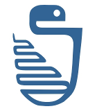

# PyZurich

Slides and materials from talks in the
[Zurich Python meetup group][pyzurich].

# Talks

## 2010

* 2010-11-16: *Experiences with using Python in Mercurial* by Martin
  Geisler • [slides][2010-11-16]

## 2013

* 2013-04-11: *BuildBot: Continuous Integration, the Python Way* by Martin
  Geisler • [slides][2013-04-11a] • [config][2013-04-11b]
* 2013-07-04: *The Pyramid Web Application Development Framework* by
  Martin Geisler • [slides][2013-07-04]

## 2014

* 2014-01-09: *Flask Web Framework* by Oleg Lavrovsky • [slides][2014-01-09]
* 2014-02-06: *Twisted is an Event-Driven Network Programming
  Framework* by Pascal Bach • [slides][2014-02-06a] •
  [examples][2014-02-06b]
* 2014-04-03: *SQLAlchemy: Python SQL Toolkit and Object Relational
  Mapper* by Martin Geisler • [slides][2014-04-03a] •
  [examples][2014-04-03b]
* 2014-09-14: *Python with Pandas* by Oleg Lavrovsky • [notebook][2014-09-14]

## 2015

* 2015-05-12: *PyParsing* by Martin Geisler • [notebook][2015-05-12a]
  • [examples][2015-05-12b]
* 2015-06-18: *Making Robots Walk with Python* by Radomir Dopieralski
  • [slides][2015-06-18]
* 2015-10-29: *Controlling Hardware with Python* by Danilo Bargen
  • [slides][2015-10-29a] • [library][2015-10-29b] • [blog][2015-10-29c]
* 2015-12-10: *Introduction to Regular Expressions* by Dariusz Smigiel
  • [slides][2015-12-10]

## 2016

* 2016-03-03: *Morepath!* by Denis Krienbühl • [slides][2016-03-03]
* 2016-03-08: *GNU Radio – Introduction to DSP* by Leszek Jakubowski •
  [slides][2016-03-08a] • [examples][2016-03-08b]
* 2016-04-07: *Switch to Python 3 Today!* by Martin Geisler •
  [slides][2016-04-07]
* 2016-04-28: *Type Hints in Python 3* by Martin Geisler •
  [slides][2016-04-28a] • [examples][2016-04-28b]
* 2016-09-01: *The Dictionary Type* by Martin Geisler •
  [slides][2016-09-01]
* 2016-12-08: *Asynchronous I/O* by Martin Geisler •
  [slides][2016-12-08]

[2010-11-16]: https://mgeisler.github.io/pyzurich/talks/2010-11-16-mercurial/python-hg-talk.pdf
[2013-04-11a]: talks/2013-04-11-buildbot/buildbot.rst
[2013-04-11b]: talks/2013-04-11-buildbot/minimal.cfg
[2013-07-04]: https://mgeisler.github.io/pyzurich/talks/2013-07-04-pyramid-web-framework/pyzh-pyramid.pdf
[2014-01-09]: https://docs.google.com/presentation/d/1Y3dEvUg3VZ-ktPGH0aTk3cMWDPDxHFEJi_QAzgHK9ew/edit?usp=sharing
[2014-02-06a]: https://mgeisler.github.io/pyzurich/talks/2014-02-06-twisted/Twisted_Presentation_2014-02-06-final.pdf
[2014-02-06b]: talks/2014-02-06-twisted/examples/
[2014-04-03a]: https://mgeisler.github.io/pyzurich/talks/2014-04-03-sqlalchemy/pyzh-sqlalchemy.pdf
[2014-04-03b]: talks/2014-04-03-sqlalchemy/
[2014-09-14]: talks/2014-09-14-pandas/
[2015-05-12a]: talks/2015-05-12-pyparsing/PyParsing.ipynb
[2015-05-12b]: talks/2015-05-12-pyparsing/
[2015-06-18]: https://mgeisler.github.io/pyzurich/talks/2015-06-18-robots/
[2015-10-29a]: https://mgeisler.github.io/pyzurich/talks/2015-10-29-hardware-with-python/slides.pdf
[2015-10-29b]: https://github.com/dbrgn/RPLCD
[2015-10-29c]: https://blog.dbrgn.ch/2014/4/20/scrolling-text-with-rplcd/
[2015-12-10]: https://mgeisler.github.io/pyzurich/talks/2015-12-10-introduction-to-re/python_re.pdf
[2016-03-03]: https://mgeisler.github.io/pyzurich/talks/2016-03-03-morepath-introduction/morepath-introduction-at-pyzurich.pdf
[2016-03-08a]: https://mgeisler.github.io/pyzurich/talks/2016-03-08-gnuradio/pres.odp
[2016-03-08b]: talks/2016-03-08-gnuradio/
[2016-04-07]: https://mgeisler.github.io/pyzurich/talks/2016-04-07-switch-to-python-3/
[2016-04-28a]: https://mgeisler.github.io/pyzurich/talks/2016-04-28-mypy/
[2016-04-28b]: talks/2016-04-28-mypy/
[2016-09-01]: https://mgeisler.github.io/pyzurich/talks/2016-09-01-dict/
[2016-12-08]: https://mgeisler.github.io/pyzurich/talks/2016-12-08-asyncio/

[pyzurich]: http://www.meetup.com/pyzurich/
