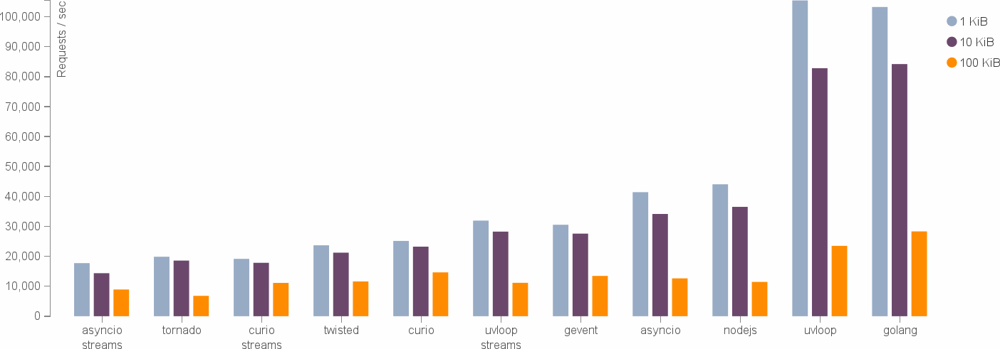
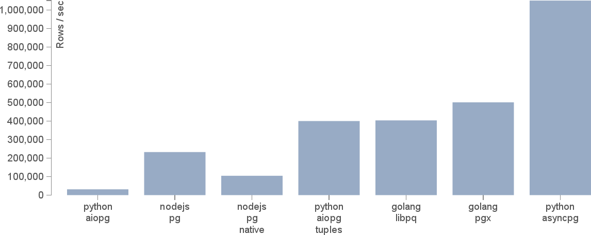

name: inverse
layout: true
class: center, middle, inverse

---

# Asynchronous I/O

Martin Geisler  
martin@geisler.net

December 8th 2016 — PyZurich

.small[https://github.com/mgeisler/pyzurich/]

---

layout: false

# PyData

A new Python-related group in Zurich:

* Bringing the world of open source data science & scientific users
  together!

* Run by Titus vøn Køllr, Jaime Fernandez, and Tim Head

* See https://www.meetup.com/PyData-Zurich/

---

# Agenda

* Promises of Asynchronous I/O

* What is Asynchronous I/O?

* Why Asynchronous I/O?

* Generators and Coroutines

* Event Loops

* Conclusion

---

# Martin Geisler

* From Denmark, lived in Zurich since 2010

* Once wrote a pile of asynchronous network code using Twisted

* Now hacking on the Go backend for Centralway Numbrs

  * _We're hiring, come talk to me afterwards!_

* Helps organize Python meetups

---

template: inverse

# Promises of Asynchronous I/O

---

# Asynchronous Networking with uvloop

Yury Selivanov: [_uvloop: Blazing fast Python networking_](https://magic.io/blog/uvloop-blazing-fast-python-networking/)

* Drop-in replacement for standard library `asyncio` module



---

# Asynchronous DB Queries with asyncpg

Elvis Pranskevichus and Yury Selivanov: [_1M rows/s from Postgres to Python_](https://magic.io/blog/asyncpg-1m-rows-from-postgres-to-python/)

* New asynchronous driver for PostgreSQL



* However, see Mike Bayer: [_Asynchronous Python and Databases_](http://techspot.zzzeek.org/2015/02/15/asynchronous-python-and-databases/)

---

template: inverse

# What is Asynchronous I/O?

---

# Blocking I/O

The traditional form of I/O is blocking:
```
from urllib import request
resp = request.urlopen('http://example.net/')
headers = resp.info()
```

* Thread of execution is paused until request is done

* Multiple threads can be used to achive parallism

---

# Non-Blocking I/O

The alternative is _non-blocking_ I/O:
```
from ... import async_request
promise = async_request.get('http://example.net/')
promise.add_callback(read_headers)
```

* Calls return _promisses_ or _futures_

* Execution immediatedly continues

* Pending actions are added as callbacks

---

# Parallism vs Concurrency

* Concurrency: executing several things with overlapping life spans

* Parallism: executing several thing at once

Asynchronous I/O gives you concurrency, but not parallelism


---

template: inverse

# Why Asynchronous I/O?

---

# Problems with Blocking I/O

Serving many parallel connections can be difficult:

```
$ python3 many_threads.py
Started 2 threads
Started 3 threads
...
Started 10561 threads
Started 10562 threads
Traceback (most recent call last):
  File "many_threads.py", line 25, in <module>
    spawn_threads(stop)
  File "many_threads.py", line 16, in spawn_threads
    t.start()
  File "/usr/lib/python3.5/threading.py", line 844, in start
    _start_new_thread(self._bootstrap, ())
RuntimeError: can't start new thread
```

---

# Why so many Connections?

Imagine a chat system with lots of websockets:

* Very long-running connections

* Little CPU usage

---

# Problems with Asynchronous I/O

Traditionally, you quickly end up in a callback-hell:
```
from ... import async_request

def get(host):
    promise = async_request.get(host)
    promise.add_callback(read_headers)
    promise.add_errback(handle_get_error)

def read_headers(data):
    # ...

def handle_error(error):
    # ...
```

* New `async` and `await` syntax in Python 3.5 helps!

---

template: inverse

# Generators and Coroutines

---

# Python 2.3: Simple Generators

The `yield` statement was added:

```
>>> def counter(maximum):
...     i = 0
...     while i < maximum:
...         yield i
...         i += 1

>>> for n in counter(3):
...     print(n)
0
1
2

```

* Amazing for lazily generating elements

* See _PEP 255 — Simple Generators_


---

# Generators are Iterators

We can step more carefully with `next`:
```
>>> numbers = counter(3)
>>> next(numbers)
0
>>> next(numbers)
1
>>> next(numbers)
2
>>> next(numbers)
Traceback (most recent call last):
  ...
StopIteration

```

---

# Starting a Generator

Generators don't start executing immediatedly:
```
>>> def forty_two():
...     print('Starting')
...     yield 42

```

Calling `forty_two` does not actualy do much:
```
>>> g = forty_two()

```

We need to step the generator to start execution:
```
>>> next(g)
Starting
42

```

---

# Python 2.5: Coroutines

The `yield` statement becomes an expression:
```
>>> def foo():
...     stop = (yield 'begin')
...     if stop:
...         return
...     yield 'end'

```

A new `send` method is used to send values into the generator:
```
>>> g = foo()
>>> g.send(None)
'begin'
>>> g.send(True)  # stop iteration here
Traceback (most recent call last):
  ...
StopIteration

```

* See _PEP 342 — Coroutines via Enhanced Generators_

---

# Subroutines

Control flow with subroutines:

* Enters _once_ per invocation

* Returns _once_ per invocation

```
def main():
    foo() ------------.
                      v
                def foo():
                    bar() ------------.
                                      v
                                def bar():
                      .------------ return
                      v
      .------------ return
      v
    return
```
---

# Coroutines

Control flow with coroutines:

* Can re-enter _multiple_ times

* Can exit _multiple_ times

```
def main():
    g = count2()
    next(g) ----------.
                      v
                def count2():
                    x = 0
      .------------ yield x  // x == 0
      v
    next(g) ----------.
                      v
                    x += 1
      .------------ yield x  // x == 1
      v
    return
```

---

# Python 3.3: Delegating to Sub-Generators

You can now pass control to a sub-generator:
```
>>> def inner():
...    yield 'foo'
...    yield 'bar'

>>> def outer():
...    yield 'before'
...    yield from inner()
...    yield 'after'

>>> g = outer()
>>> list(g)
['before', 'foo', 'bar', 'after']

```

* See [_PEP 380: Syntax for Delegating to a Subgenerator_][pep380]


---

# Communicating with a Sub-Generator

The `send` method talks directly with the inner iterator:
```
>>> def inner():
...    x = yield 'foo'
...    return ('inner', x)

>>> def outer():
...    y = yield from inner()
...    yield ('outer', y)

>>> g = outer()
>>> g.send(None)
'foo'
>>> g.send('bar')
('outer', ('inner', 'bar'))

```

* Allows refactoring of coroutines

---

# Python 3.5: Native Coroutines

New keywords were introduced for coroutines:
```
>>> async def foo():
...    return 3 + 3 * 3 + 3

>>> async def bar():
...    v = await foo()
...    return v * 3 - 3

>>> coro = bar()
>>> try:
...     coro.send(None)
... except StopIteration as the_answer:
...     print('The answer:', the_answer.value)
The answer: 42

```

* See [_PEP 492: Coroutines with async and await syntax_][pep492].


---

# Async, Await...

Python joins many other languages with the same keywords:

* [JavaScript](https://tc39.github.io/ecmascript-asyncawait/) (candiate proposal)

* [Scala](http://docs.scala-lang.org/sips/pending/async.html) (pending)

* [Dart](https://www.dartlang.org/articles/language/await-async)

* [Hack](https://docs.hhvm.com/hack/async/introduction)

* [C#](https://msdn.microsoft.com/en-us/library/mt674882.aspx)

---

template: inverse

# Event Loops

---

# Building an Event Loop

We now have the building blocks needed for an event loop:

* We can suspend computations with `yield`

* We can resume computations with `send`

* We can delegate to computations with `await`

---

# Demos!

* Fetching web pages in sequence and concurrently

* Simple echo server and echo client

---

template: inverse

# Conclusion

---

# Conclusion

Asynchronous I/O can help you in some cases:

* You have I/O bound applications

* You have lots and lots of long-lived connections

* Very pleasant syntax, no direct callbacks

--

However, it also comes with constraints:

* Need Python 3.5 for `async` and `await`

* Need a fully asynchronous stack

---

template: inverse

# Thanks!

---

# Resources

Some good resources to get to know this new world:

* David Beazley: [_Topics of Interest (Python Asyncio)_](https://youtu.be/ZzfHjytDceU)

* Brett Cannon: [_How the heck does async/await work in Python 3.5?_](http://www.snarky.ca/how-the-heck-does-async-await-work-in-python-3-5)

* A. Jesse Jiryu Davis and GvR: [_A Web Crawler With asyncio Coroutines_](http://aosabook.org/en/500L/a-web-crawler-with-asyncio-coroutines.html)

* Python: [_Asynchronous I/O, event loop, coroutines and tasks_](https://docs.python.org/3/library/asyncio.html)

* Doug Hellmann: [_Asynchronous I/O, event loop, and concurrency tools_](https://pymotw.com/3/asyncio/)

* Glyph: [_Unyielding_](https://glyph.twistedmatrix.com/2014/02/unyielding.html)

* Armin Ronacher: [_I don't understand Python's Asyncio_](http://lucumr.pocoo.org/2016/10/30/i-dont-understand-asyncio/)


[pep380]: https://www.python.org/dev/peps/pep-0380/
[pep492]: https://www.python.org/dev/peps/pep-0492/
