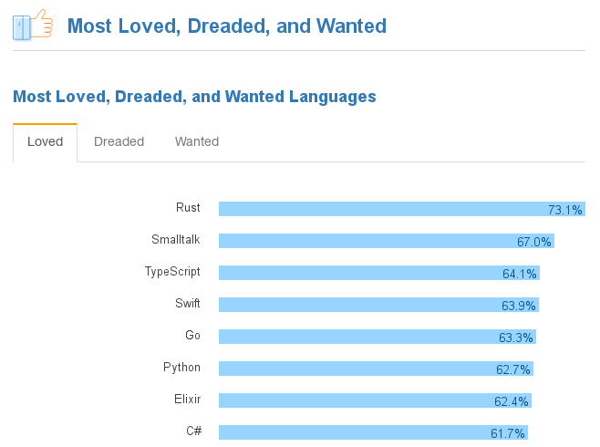
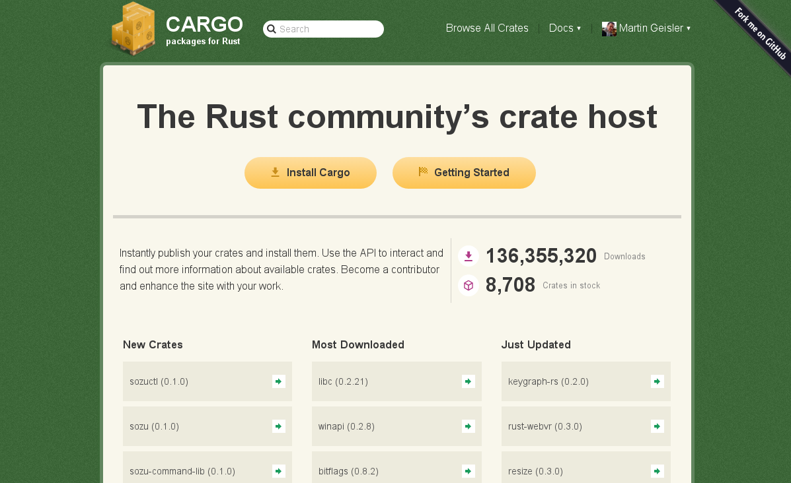

name: inverse
layout: true
class: center, middle, inverse

---

background-image: url(rust-logo-512x512.png)


# Extending Python with Rust

Martin Geisler  
martin@geisler.net

April 6th, 2017 — PyZurich

.small[https://github.com/mgeisler/pyzurich/]

.small[https://www.meetup.com/Rust-Zurich/]

.credit[CC-BY Rust logo by [Mozilla](https://www.rust-lang.org/legal.html)]

---

layout: false

# Agenda

* Introduction to Rust

* Python Extensions

* Conclusion

---

# Martin Geisler

* From Denmark, lived in Zurich since 2010

* Interested in high-level and elegant code

* Now working on the Go backend at Centralway Numbrs

  * _We're hiring, please come talk to me afterwards :-)_

* Helps organize Python meetups

---

template: inverse


# The Rust Programming Language

---

# Hello PyZurich

* How does Rust look and feel?

* (Demo, code on next slide.)

---

# Hello PyZurich

.small[
```
#[macro_use]
extern crate serde_derive;
extern crate serde_json;
extern crate hyper;

use hyper::client::Client;

#[derive(Deserialize, Debug)]
struct Event {
    name: String,
    yes_rsvp_count: u16,
}

fn main() {
    let client = Client::new();
    let req = client.get("http://api.meetup.com/pyzurich/events/236240899");

    println!("Hello PyZurich!  Please wait, fetching data...");
    match req.send() {
        Ok(resp) => {
            println!("Response status: {}", resp.status);
            let event: Event = serde_json::from_reader(resp).unwrap();
            println!("Many thanks to all {} of you for coming to {}!",
                     event.yes_rsvp_count, event.name);
        }
        Err(err) => println!("Ups, an error occured: {}", err),
    }
}

```
]

---

# Some Language Features

What did we just see?

* Strongly typed language

* Sum types (tagged unions)

* Pattern matching

* Generics

* Traits (type classes)

* No garbage collection

* No exceptions

* Hygienic macros

* Modern UTF-8 strings

* ...


---

# Rust Praise

.credit[https://people.gnome.org/~federico/news-2016-10.html#25]

About rewriting parts of `librsvg` in Rust:

> Every once in a while someone discovers a bug in librsvg that makes
> it all the way to a CVE security advisory, and it's all due to using
> C.
>
> We've gotten double free()s, wrong casts, and out-of-bounds
> memory accesses. Recently someone did fuzz-testing with some really
> pathological SVGs, and found interesting explosions in the library.
>
> That's the kind of 1970s bullshit that Rust prevents.

---

# StackOverflow Developer Survey 2017



.credit[http://stackoverflow.com/insights/survey/2017#most-loved-dreaded-and-wanted]

---

# Rust Package Manager: Cargo

.credit[CC-BY Cargo logo by [Mozilla](https://www.rust-lang.org/legal.html)]
.bottom-right[]

Cargo makes it very easy to get started:

```sh
$ cargo init --bin helloworld
$ cd helloworld
$ cargo run
   Compiling helloworld v0.1.0 (file:///.../helloworld)
    Finished dev [unoptimized + debuginfo] target(s) in 0.21 secs
     Running `target/debug/helloworld`
Hello, world!

```

Cargo will

* handle dependencies

* run your tests

* benchmark your code

* generate documentation

* much more...

---

# The Crate Shop: [crates.io](https://crates.io/)



---

# Rust Documentation

Beautiful and Python-like documentation:

* Standard Library Documentation: https://doc.rust-lang.org/std/

* The Rust Book: https://doc.rust-lang.org/book/

* Rust by Example: http://rustbyexample.com/

---

# Rust History

Major mile-stones:

* 2006: Started as a side-project by Graydon Hoare

* 2009: Mozilla becomes involved

* 2015: Rust version 1.0 released

* 2016: Firefox shipped with MP4 parser written in Rust

Used by real companies:

* Rust Friends: https://www.rust-lang.org/friends.html


---

# Platform Support

Thanks to LLVM, Rust can be compiled for many targets:

* Tier 1: Linux, Windows, MacOS

* Tier 2: ARM64 iOS, ARMv7 Android, WebAssembly, NetBSD, FreeBSD, ...

* Tier 3: Sparc, PNaCl, WinXP, various microcontrollers, ...

See https://forge.rust-lang.org/platform-support.html

---

template: inverse


# Fast: Abstraction Without Overhead

---

# Zero-Cost Abstractions

Like C++, Rust is designed around *zero-cost abstractions*:

* The code compiles to the same as a hand-written program

* The abstractions do not add overhead

---

# Cost of Abstractions

Consider two ways of computing an inner product:

```
let inner_product = x1 * x2 + y1 * y2 + z1 * z2 + w1 * w2;
```
and
```
let inner_product = xs.iter().zip(ys).map(|(x, y)| x * y).sum();

```

---

# Function Calls in Rust

Benchmarking with Cargo:
```
running 2 tests
test tests::bench_slices   ... bench:           3 ns/iter (+/- 0)
test tests::bench_unrolled ... bench:           3 ns/iter (+/- 0)

```

The `rustc` compiler generates LLVM IR:

* can compile code to many target platforms

* benefits from state-of-art LLVM optimizer

---

# Function Calls in Python

Benchmarking with `timeit`:

```sh
$ python -m timeit -s 'x1, x2, x3, x4 = [10, 20, 30, 40]' \
                   -s 'y1, y2, y3, y4 = [50, 60, 70, 80]' \
                   'x1 * y1 + x2 * y2 + x3 * y3 + x4 * y4'
10000000 loops, best of 3: 0.128 usec per loop

$ python -m timeit -s 'xs = [10, 20, 30, 40]' \
                   -s 'ys = [50, 60, 70, 80]' \
                   'sum([x * y for (x, y) in zip(xs, ys)])'
1000000 loops, best of 3: 0.507 usec per loop
```

--

We might try to avoid constructing the list:

```sh
$ python -m timeit -s 'xs = [10, 20, 30, 40]' \
                   -s 'ys = [50, 60, 70, 80]' \
                   'sum(x * y for (x, y) in zip(xs, ys))'
1000000 loops, best of 3: 0.601 usec per loop

```

We now also pay for the generator abstraction!

---

template: inverse

# Safety: Memory Safety Without Garbage Collection

---

# Memory Safety

Unlike C and C++, Rust is by default *memory safe*:

* Array bounds are checked

* There can be no dangling pointers

* No reads from uninitialized memory


Inside *unsafe* Rust, one can

* Access static mutable variables (potential data race)

* Dereference raw pointers (can violate memory safety)

* Call other unsafe functions (can do lots of things)


---

# Ownership, Borrowing, Lifetimes

Rust has a unique model for managing memory:

* The compiler tracks *ownership* of variables

* Ownership tells it when it can deallocate memory

* Ownership rules also prevent *aliasing*

* Variables can be *borrowed*:

    * Many read-only borrows

    * At most one mutable borrow

This is all checked at compile-time

---

# Being Fast and Memory Safe

Iterators often allow the compiler to elide bounds checks:

```
println!("x⃗ ⨯ y⃗: {}", xs.iter().zip(ys).map(|(x, y)| x * y).sum());
```

No bounds checking necessary here!


---

template: inverse

# Concurrency without Data Races

---

# Fearless Concurrency with Rust

Rust has reference counted pointers:

* `Rc` uses normal reference counting

* `Arc` uses atomic operations, implements `Send`

Compiler enforces that you can only share values wrapped in `Arc`:

* Access to shared state must be synchronized

* Statically eliminates *data races*

---

template: inverse

# Integrating with Python

---

# Simple Way: Shared Objects

Rust has no runtime and can easily generate a libray:

```toml
[lib]
crate-type = ["cdylib"]
```

Tell Rust to use the C ABI for your functions:
```
#[no_mangle]
pub extern "C" fn max_byte(base: *const u8, len: usize) -> u8 {
    // ...
}
```

Call your function from Python with `ctypes`:
```python
import ctypes
lib = ctypes.cdll.LoadLibrary('target/release/libshared_object.so')
print(lib.max_byte(buf, len(buf)))
```

* you can only pass and return basic C types

* someone must free memory allocated in Rust


---

# Building Rust Extensions

The `setuptools-rust` package makes it easy to call Cargo:

```python
from setuptools import setup
from setuptools_rust import RustExtension

helloworld = RustExtension('hello_rust._helloworld',
                           'extensions/Cargo.toml')

setup(name='hello-rust',
      version='1.0',
      rust_extensions=[helloworld],
      packages=['hello_rust'],
      # Rust extensions are not zip safe, just like C extensions
      zip_safe=False
)
```

See https://github.com/fafhrd91/setuptools-rust

---

# Comprehensive Way: cpython Crate

There is a `cpython` crate that wraps the cpython C API:
```
fn word_count(py: Python,
              text: PyString)
              -> PyResult<HashMap<String, u64>> {
    let s = text.to_string(py)?;
    // We now operate on Rust types only
    let mut counts = HashMap::new();

    for word in s.split_whitespace() {
        if word.len() < 5 {
            continue;
        }
        let lower = word.to_lowercase();
        *counts.entry(String::from(lower)).or_insert(0) += 1;
    }
    // Convert Rust type back to Python
    Ok(counts)
}
```

---


---

template: inverse

# Conclusion

---

# Rust Programming Language

Rust provides a real competitor to C and C++

* Powerful type system keeps your programs safe

* Modern and expressive language

* Designed to be fast

---

# Extending Python with Rust

The `rust-cpython` crate is a high-level wrapper for the C API:

* Fast, zero-cost abstraction: as efficient as the C API itself

* Safe: automatically manages reference counts for you

---

template: inverse

# Thanks!

---

template: inverse

# Extra Material

---

# Rust Influcences

* SML, OCaml: algebraic data types, pattern matching, type inference

* C++: references, RAII, smart pointers, move semantics, monomorphization, memory model

* Haskell: typeclasses, type families

* Newsqueak, Alef, Limbo: channels, concurrency

* Erlang: message passing, thread failure

* Swift: optional bindings

* Scheme: hygienic macros

* C#: attributes

* Ruby: block syntax

---

# Cross Compilation

With `rustup`, it's fairly easy to get started with cross compilation:

```sh
$ sudo apt-get install gcc-arm-linux-gnueabihf
$ rustup target add armv7-unknown-linux-gnueabihf
$ mkdir -p ~/.cargo
$ cat >> ~/.cargo/config <<EOF
> [target.armv7-unknown-linux-gnueabihf]
> linker = "arm-linux-gnueabihf-gcc"
> EOF
```

Testing with `cargo`:
```sh
$ cargo new --bin hello
$ cd hello
$ cargo build --target=armv7-unknown-linux-gnueabihf
   Compiling hello v0.1.0 (file:///home/ubuntu/hello)
$ file target/armv7-unknown-linux-gnueabihf/debug/hello hello: ELF
32-bit LSB shared object, ARM, EABI5 version 1 (SYSV), dynamically
linked (uses shared libs), for GNU/Linux 2.6.32, not stripped

```
