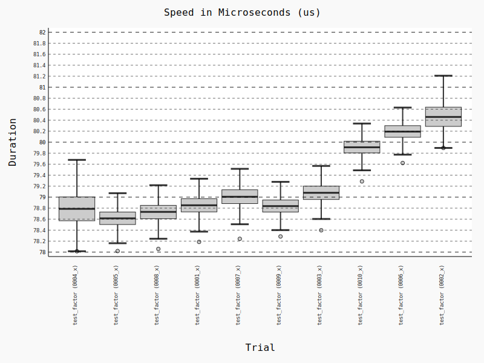

name: inverse
layout: true
class: center, middle, inverse

---

# Benchmarking with pytest-benchmark

Martin Geisler  
martin@geisler.net

July 6th, 2017 — PyZurich

.small[https://github.com/mgeisler/pyzurich/]

---

layout: false

# Agenda

* Introduction to Pytest

* Benchmarking

* Conclusion

---

# Martin Geisler

* From Denmark, lived in Zurich since 2010

* Interested in high-level and elegant code

* Helps organize Python meetups

---

template: inverse

# Pytest Introduction

---

# Pytest

Pytest has quickly become a very popular test runner for Python:

* It's super light weight

* Shows detailed errors when a test fails

* Very extensible

---

# Pytest Example

Pytest will by default find tests inside `test_*.py` files:


--

Compare this with the `unittest` standard library module:

```
import unittest

def inc(x):
    return x + 1

class TestInc(unittest.TestCase):
    def test_inc(self):
        self.assertEqual(int(3), 5)
```

---

# Pytest Failures

Execute the tests by running `pytest`:

```
$ pytest
======= test session starts ========
platform linux -- Python 3.x.y, pytest-3.x.y, py-1.x.y, pluggy-0.x.y
rootdir: $REGENDOC_TMPDIR, inifile:
collected 1 item

test_sample.py F

======= FAILURES ========
_______ test_inc ________

    def test_inc():
>       assert inc(3) == 5
E       assert 4 == 5
E        +  where 4 = inc(3)

test_sample.py:5: AssertionError
======= 1 failed in 0.12 seconds ========
```

---

# Assertion Details

Pytest allows you use use standard `assert` statements:


Assertion errors are parsed and the values of subexpressions are shown:

```
========= FAILURES ==========
________ test_concat ________

    def test_concat():
        foo = 'Hello'
        bar = 'World!'
>       assert len(foo) + len(bar) == len('Hello, world')
E       AssertionError: assert (5 + 6) == 12
E        +  where 5 = len('Hello')
E        +  and   6 = len('World!')
E        +  and   12 = len('Hello, world')

test_concat.py:4: AssertionError
```

---

# Pytest Fixtures

Pytest has a brilliant plugin mechanism called *fixtures*:


---

# Setup and Teardown Functionality

Pytest fixtures are used for setup and teardown functionality:

```
import pytest

@pytest.fixture
def db():
    # Setup code
    db = open_db_connection()

    # Return database connection
    yield db

    # Teardown code
    db.close()

@pytest.fixture
def website(db):
    site = create_empty_site(db, "My little blog")
    site.insert_post("First Post", "Martin Geisler")
    return site

def test_site_title(website):
    assert website.title == "My little blog"
```

---

template: inverse

# Benchmarking with pytest-benchmark

---

# Benchmark Fixture

Pytest plugin that provides a `benchmark` fixture:

```
def factor(n):
    return [x for x in range(2, n) if n % x == 0]

def test_factor(benchmark):
    result = benchmark(factor, 1001)
    assert result == [7, 11, 13, 77, 91, 143]
```

---

# Running Benchmarks

Run the benchmark by running `pytest`:

```
$ pytest test_factor.py
============================= test session starts ==============================
platform linux -- Python 3.5.3+, pytest-3.1.3, py-1.4.34, pluggy-0.4.0
benchmark: 3.0.0 (defaults: timer=time.perf_counter disable_gc=False min_rounds=5 min_time=5.00us max_time=1.00s calibration_precision=10 warmup=False warmup_iterations=100000)
rootdir: /home/mg/src/pyzurich/talks/2017-07-06-pytest-benchmark, inifile:
plugins: benchmark-3.0.0
collected 1 item s

test_factor.py .


------------------------------------------- benchmark: 1 tests -------------------------------------------
Name (time in us)         Min       Max     Mean  StdDev   Median     IQR  Outliers(*)  Rounds  Iterations
----------------------------------------------------------------------------------------------------------
test_factor           77.9470  183.7730  79.1440  3.7108  78.6080  0.2500      264;745   11131           1
----------------------------------------------------------------------------------------------------------

(*) Outliers: 1 Standard Deviation from Mean; 1.5 IQR (InterQuartile Range) from 1st Quartile and 3rd Quartile.
=========================== 1 passed in 1.95 seconds ===========================
```

---

# Selecting Output Columns

The output is very wide by default!

Install pytest-benchmark 3.1.0a2 and use `--benchmark-columns`:

```
% pytest test_factor.py --benchmark-columns=min,max,median
============================= test session starts ==============================
platform linux -- Python 3.5.3+, pytest-3.1.3, py-1.4.34, pluggy-0.4.0
benchmark: 3.1.0a2 (defaults: timer=time.perf_counter disable_gc=False min_rounds=5 min_time=0.000005 max_time=1.0 calibration_precision=10 warmup=False warmup_iterations=100000)
rootdir: /home/mg/src/pyzurich/talks/2017-07-06-pytest-benchmark, inifile:
plugins: benchmark-3.1.0a2
collected 1 item s

test_factor.py .


-------------- benchmark: 1 tests --------------s (1/1)
Name (time in us)         Min       Max   Median
------------------------------------------------
test_factor           77.9940  178.1040  78.6230
------------------------------------------------

(*) Outliers: 1 Standard Deviation from Mean; 1.5 IQR (InterQuartile Range) from 1st Quartile and 3rd Quartile.
=========================== 1 passed in 1.94 seconds ===========================

```

---

# Comparing Past Runs

First, save some benchmark data:

```sh
$ pytest test_factor.py --benchmark-save x
```

Then use the `pytest-benchmark` utility to compare runs:

```
$ pytest-benchmark compare 0001 0002 --columns min,median
--------------------- benchmark: 2 tests --------------------
Name (time in us)            Min             Median
-------------------------------------------------------------
test_factor (0001_x)     78.1860 (1.0)      78.8520 (1.0)
test_factor (0002_x)     79.8950 (1.02)     80.4590 (1.02)
-------------------------------------------------------------
```

--

Can use `--auto-save` to derive a name from Git or Mercurial commit.

---

# Performance over Time

```sh
$ pytest-benchmark compare '*' --histogram benchmark
```



---

template: inverse

# Conclusion

---

# Benchmarking with Pytest

Pytest provides an easy to use test framework:

* Lots of features out of the box.

* Extensible with plugins of many kinds.

--

The pytest-benchmark plugin makes it super easy to capture benchmarks:

* Reproducable and standardized benchmarks for your project.

* Execute them as part of your normal test suite.

* Save the results and watch out for regressions.

---

template: inverse

# Thanks!
